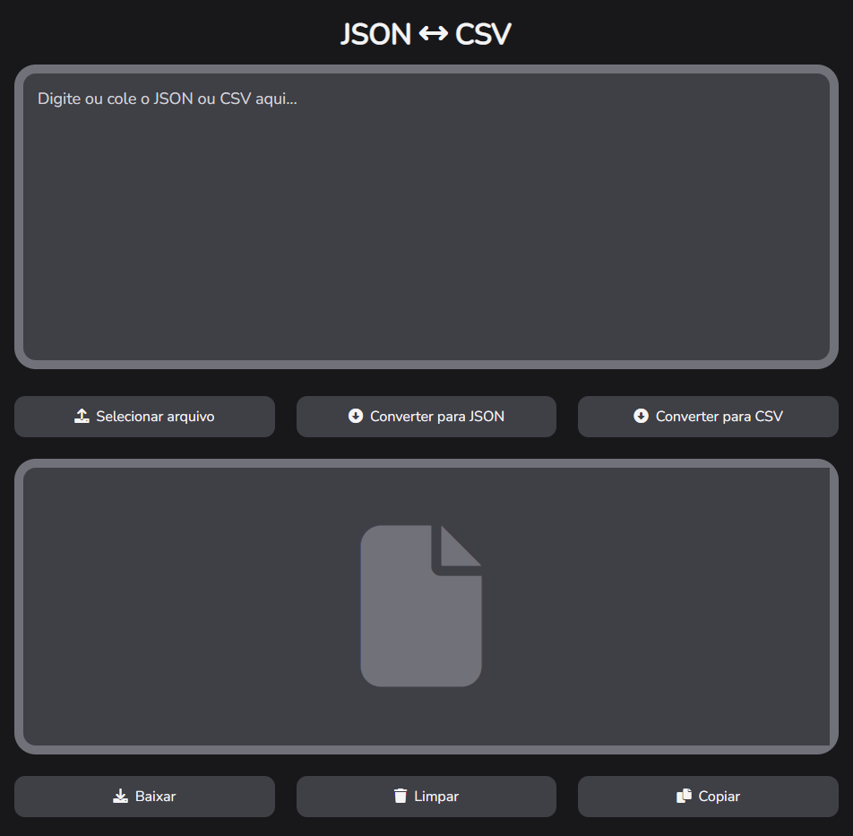

<h1 align="center">JSON CSV Converter</h1>

<h1 align="center">
  
</h1>

## 💻 Projeto

O JSON CSV Converter é um projeto que permite que você converta JSON em CSV ou vice versa. Para converter o texto você pode digitar ou selecionar o arquivo que deseja converter. Ao converter, você pode salvar o resultado em um arquivo ou copiar para a área de transferência.

## ✨ Tecnologias

Esse projeto foi desenvolvido com as seguintes tecnologias:

- [React](https://pt-br.reactjs.org/)
- [TypeScript](https://www.typescriptlang.org/)

## 🚀 Como executar

- Clone o repositório
- Instale as dependências com `npm install`
- Inicie a aplicação com `npm run dev`

A aplicação pode ser acessada em [`localhost:5173`](http://localhost:5173).

## 📄 Licença

Esse projeto está sob a licença MIT. Veja o arquivo [LICENSE](LICENSE) para mais detalhes.

---

Desenvolvido por Tiago Faria.
